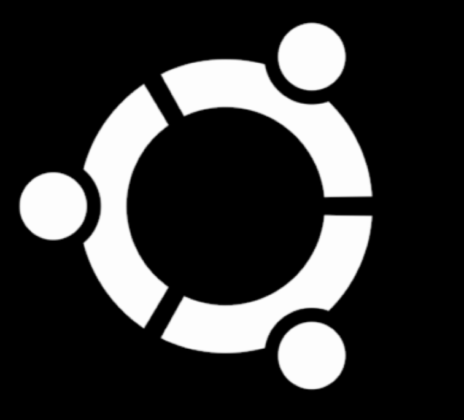

# Exercise to test Podium's Home Page

## Git repo


## To run the tests
Scenarios 2 and 3 below require you to have a version of Docker installed and running on your machine.

On my machine, a MacBook Pro, I use "Docker Desktop" v3.1.0

### Scenario 1
If your machine has installed:
Chrome driver at least version 86
Python version at least 3.6

You can try running the tests if either chromedriver or python are around 8x and 3.x respectively.

Install these packages if not already installed in your machine:

```
selenium
allure-pytest
pytest-html
requests
```

You can install the packages via

`pip install -r requirements.txt`

Alternatively you can run the command

`pip install selenium allure-pytest pytest-html requests`


To run all the tests:
```
python -m pytest --cache-clear --html=report.html
```

To run one of the tests:
```
python -m pytest --cache-clear --html=report.html tests/test_podium_home_page_content.py
```

where the available tests are:
```
test_podium_home_page_content.py
test_podium_login_page.py
test_podium_pricing_page.py
```

**Note**

For all scenarios a report file called `report.html` is created that gives us a report of the tests ran.  You can open it with your favorite browser.

### Scenario 2
If your machine does not have a version of chromedriver installed but has a version of python version at least 3.6

## Install (and run) a Dockerized version of chromedriver

`docker run -it -p 4444:4444 -p 0:5900 -v /dev/shm:/dev/shm selenium/standalone-chrome-debug`

## Install and configure VNC viewer
Download from [realvnc](https://www.realvnc.com/en/connect/download/viewer/).  Install the application on your machine.

**Note** 

If on a Mac you might need to give permissions to the app in Preferences/Security & Privacy/


## Run the chromedriver Docker container
The chromedriver container should already be running on your machine.  See step above titled "Install (and run) a Dockerized version of chromedriver"


If for some reason you have to run it again use

`docker run -d -p 4444:4444 -p 0:5900 -v /dev/shm:/dev/shm selenium/standalone-chrome-debug`

## Configure VNC viewer
- See what port is the chromedriver exposing to the host machine, run
`docker ps`

You should see something similar to this:
```
CONTAINER ID   IMAGE                              COMMAND                  CREATED          STATUS          PORTS                                             NAMES
662a6b09f8ae   selenium/standalone-chrome-debug   "/opt/bin/entry_poin…"   18 seconds ago   Up 18 seconds   0.0.0.0:4444->4444/tcp, 0.0.0.0:55001->5900/tcp   dreamy_cannon
(base) [pedro pedros-mbp 19:21:05 exercise ]
```

On my machine port `5900` is being mapped to `port 0.0.0.0:5501`

- Start `vnC Viewer`
- Create a new connection by pressing `cmd+n` or select "New conection" from the `File` menu.
- In the `VNC Server` field enter the port number.  In this case `port 0.0.0.0:5501`
- In the Name field enter a name

- Click 'OK'
- Launch the connection. If the chromedriver started correctly the first time you should see a dialog warning you about an "unencrypted connection"
- Tick on "Don't warn me about this again"
- Click on the "continue" button

- The first time after you create a connection you will be prompted for a password.
- Enter the password `secret`
- Tick on "Remember password"
- Click 'OK'
- If everything went well you'll see a window that displays this symbol:


## Change the file conftest.py
Now you are almost ready to run the tests on your machine and see them running inside the Dockerized version of chromedriver.

- In the code open the file `tests/conftest.py` and comment the code for `Scenario 1` and uncomment the code for `Scenario 2` as follows:
```
# --- Scenario 1
  # --- Uncomment the line below to see tests running outside of Docker
  # --- Comment out the code for scenarios 2 and 3 below. 
  # driver = Chrome()
  # --- end of Scenario 1

  # --- Scenario 2
  # --- Uncomment the lines below to see tests running outside of Docker
  # --- Comment out the code for scenarios 1 above and 3 below. 

  chrome_options = Options()
  chrome_options.add_argument('--no-sandbox')
  chrome_options.add_argument('--disable-dev-shm-usage')
  driver = webdriver.Remote("http://127.0.0.1:4444/wd/hub", options=chrome_options)
  driver = Chrome(chrome_options=chrome_options)
  # driver.set_window_size(1920, 1080)
  # --- end of Scenario 2
  ```
- save the file

## Run the tests
- From a `bash` shell run

`python -m pytest --cache-clear  --html=report.html`

If for some reason the tests fail it might be because the default size of the Chrome window is not sufficiently wide to display what I am calling the "Podium menu bar"


In that case uncomment the line `# driver.set_window_size(1920, 1080)` in the file `tests/conftest.py`, save the file, and run the tests again.

### Scenario 3
Use this scenario if your machine does not have a version of chromedriver installed nor does it have a python version at least 3.6

For this you will be creating a Docker image that contains chromedriver, python and all the packages necessary to run the tests.

## Create the Docker image
From the root directory of the project run `docker build -t podium:1 .`

## Check the Docker image was created
Once the image is done building run the command `docker images`.  You should see a list of the available Docker images in your machine.  You should see the new image, `podium` with `TAG` 1, in the list

```
docker images
REPOSITORY                         TAG           IMAGE ID       CREATED          SIZE
podium                             1             defe1e5e6178   40 seconds ago   1.4GB
selenium/standalone-chrome-debug   latest        6a3a9ed31627   4 days ago       1.04GB
```

## Change the file conftest.py
You are now almost ready to run the tests on your machine and see them running, headless, inside the Docker image `podium:1`.

- In the code open the file `tests/conftest.py` and comment out the code for `Scenario 1` and for `Scenario 2`, uncomment the code for `Scenario 3`, the configuration file should look like this:
```
# --- Scenario 1
# --- Uncomment the line below to see tests running outside of Docker
# --- Comment out the code for scenarios 2 and 3 below. 
# driver = Chrome()
# --- end of Scenario 1

# --- Scenario 2
# --- Uncomment the lines below to see tests running outside of Docker
# --- Comment out the code for scenarios 1 above and 3 below. 

# chrome_options = Options()
# chrome_options.add_argument('--no-sandbox')
# chrome_options.add_argument('--disable-dev-shm-usage')
# driver = webdriver.Remote("http://127.0.0.1:4444/wd/hub", options=chrome_options)
# #driver.set_window_size(1920, 1080)
# --- end of Scenario 2

# --- Scenario 3
# --- comment from below to see tests running within Docker

chrome_options = Options()
chrome_options.add_argument('--headless')
chrome_options.add_argument('--no-sandbox')
chrome_options.add_argument('--disable-dev-shm-usage')
driver = Chrome(chrome_options=chrome_options)
driver.set_window_size(1920, 1080)
# --- comment from above to see tests running in Docker
# --- end of Scenario 3
```
- save the file

## Run the Docker container and start a `bash` shell
`docker run -it -w /usr/workspace -v $(pwd):/usr/workspace podium:1 bash`

## Run the tests
- From the `bash` shell inside the image run:

`python -m pytest --cache-clear  --html=report.html`

## View the test results
Because of personal time constraints I did not want to spend a lot of time figuring out how to expose the ports from within the Docker image so that the tests could be watched being run in the browser in VNC. The console will give you information about the tests running but you can't see them running in a browser.

But remember for all scenarios a report file called `report.html` is created.  You can open it with your favorite browser and see the results of the tests.